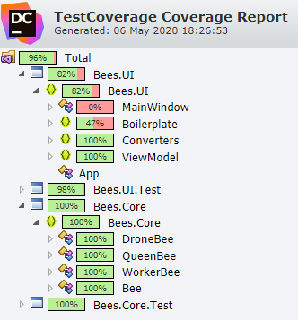

# Coding Challenge

This coding challenge is an OO based challenge for C#.
The specification of the challenge can be found [here](Challenge.md).

## Part 1

I have addressed Part 1 by creating the "Bees.Core" project as a .NET Standard class library to be later re-used. It's design is loosely coupled so can be further extended later on if required.

## Part 2

I have addressed Part 2 by creating the "Bees.UI" project as a .NET Core 3 WPF application using MVVM concepts. This is not my strong point since my usual UIs are web-based and my knowledge of MVVM and WPF is limited.

The Boilerplate file "RelayCommand.cs" is a file re-used from a previous MVVM project to make using an ICommand easier.

## Testing

Unit tests have been written to cover the requirements provided to ensure that all required functionality is present.

NUnit 3 was chosen as the testing framework since it's what I'm comfortable with and didn't see any reason to use something different right now.

The format of the tests follow a GivenASituation_ThisActionShouldHappen format.

A report of the test coverage can be found [here](TestCoverage.zip).

## What I'd do differently next time

- I'd change is the way which the view model populates the bees by extracting that functionality to a more commonly used pattern.
- I'd change is to take some of the hard-coded values out in to an application settings file to be able to adjust them on the fly. Examples of these values include the intial health of the bees, the 0-80 range for how much damage is dealt, how many of each type of bee are generated.
- I'd also dependency inject the Random class to be able to mock it in tests to be able to test how much damage will be dealt. This is because there is a (very) small chance that it can return 0 and potentially deal no damage.
- I'd also look at some UI testing frameworks to be able to test things such as all elements being visible, actually pressing the buttons and seeing UI elements react to that.
